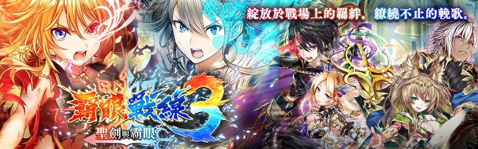

# 聖劍與霸眼

## 序章 

獨立於【活動任務】中

1. **繼承霸眼之人**
2. **守護聖劍之手**
3. **擦肩而過的霸眼**

## 倒映在眼底的戰火 

1. **希貝爾尼亞皇帝**
2. **重建同盟軍**
3. **霸眼衝突**
4. **被竊走的霸眼**

### 盟主寶座的價值 

1. **盟主麗維塔**
2. **為了結算過去**
3. **海盜「鐡鬍子團」**
4. **使用聖劍者**

## 在沙塵裡端的死亡 

1. **魔杖回歸持有者身上**
2. **不足夠的是…**
3. **葛家血統與榮耀**

以下缺綠

## 心被輝眼所破壞輝… 

1. **軍事會議**
2. **千鈞一髮**
3. **正道王之意**
4. **燃燒殆盡的鬥志**
5. **握緊雙手者**

## 上天請賜予慈悲 

1. **亞人的女王**
2. **奇怪的兩人**
3. **邪教的嫡子**
4. **劍聖王的承傳**
5. **霸眼覺醒**

## 倒映在眼裡的是 

1. **聖劍與霸眼所導致的災禍**
2. **戰士們集結**
3. **阻擋去路８騎將**
4. **無法被原諒的信念**
5. **統治世界之眼**
6. **後日談**

