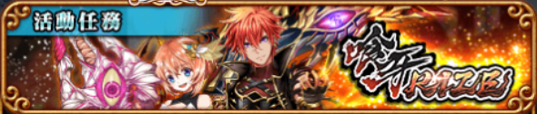

# 喰牙RIZE

## 序章

## 初級 炎彗峽谷

## VS 死魂埋葬者

以下缺

## 中級 聖光湖

## VS 烈刀激閃

## 〈死焰族〉的責任

## 能先知嗎？

## 上級 剛龍山

## 敗北的盡頭

## VS Q彈綿軟神柔拳

## 【咒具竊盜】未羽

## 不該看見之物

## 封魔級 無惡不作的外法魔

## 撕裂之牙

## 劍問答

## 不齊全之牙

## 絕級 天涯咆哮

## 混沌降臨

## 繼承牙者

## 霸級 鋒刃之牙

